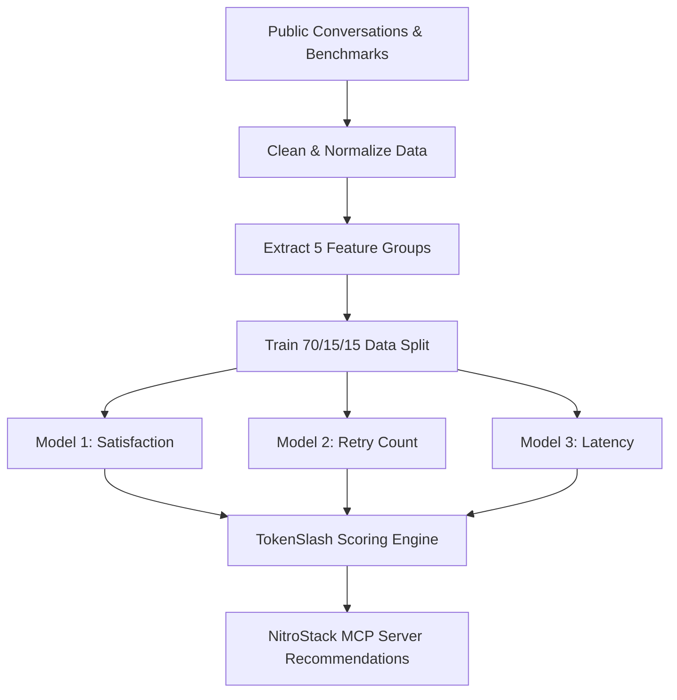

# 🏛️ TokenSlash ML Architecture & Flow Diagrams

### Multi-Objective Scoring Equation

$$\text{TokenSlash Score} = 100 \times \frac{w_s \cdot \text{NormSat} + w_f \cdot \text{NormFit} - w_c \cdot \text{NormCost} - w_l \cdot \text{NormLat} - w_r \cdot \text{NormRetry}}{\sum w}$$
