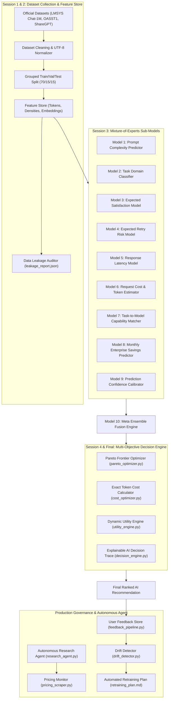

# 🏗️ PromptIQ Machine Learning & Production Intelligence Architecture

```mermaid
flowchart TD
    subgraph DataPipeline ["Session 1 & 2: Dataset Collection & Feature Store"]
        A["Official Datasets (LMSYS Chat-1M, OASST1, ShareGPT)"] --> B["Dataset Cleaning & UTF-8 Normalizer"]
        B --> C["Grouped Train/Val/Test Split (70/15/15)"]
        C --> D["Feature Store (Tokens, Densities, Embeddings)"]
        D --> E["Data Leakage Auditor (leakage_report.json)"]
    end

    subgraph MoEEngine ["Session 3: Mixture-of-Experts Sub-Models"]
        F1["Model 1: Prompt Complexity Predictor"]
        F2["Model 2: Task Domain Classifier"]
        F3["Model 3: Expected Satisfaction Model"]
        F4["Model 4: Expected Retry Risk Model"]
        F5["Model 5: Response Latency Model"]
        F6["Model 6: Request Cost & Token Estimator"]
        F7["Model 7: Task-to-Model Capability Matcher"]
        F8["Model 8: Monthly Enterprise Savings Predictor"]
        F9["Model 9: Prediction Confidence Calibrator"]
    end

    D --> MoEEngine
    MoEEngine --> G["Model 10: Meta Ensemble Fusion Engine"]

    subgraph ScoringEngine ["Session 4 & Final: Multi-Objective Decision Engine"]
        H["Pareto Frontier Optimizer (pareto_optimizer.py)"]
        I["Exact Token Cost Calculator (cost_optimizer.py)"]
        J["Dynamic Utility Engine (utility_engine.py)"]
        K["Explainable AI Decision Trace (decision_engine.py)"]
    end

    G --> ScoringEngine
    ScoringEngine --> L["Final Ranked AI Recommendation"]

    subgraph ProductionIntelligence ["Production Governance & Autonomous Agent"]
        M["User Feedback Store (feedback_pipeline.py)"] --> N["Drift Detector (drift_detector.py)"]
        O["Autonomous Research Agent (research_agent.py)"] --> P["Pricing Monitor (pricing_scraper.py)"]
        N --> Q["Automated Retraining Plan (retraining_plan.md)"]
    end

    L --> M
```
